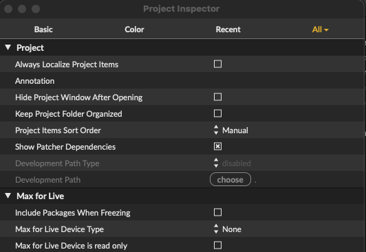

# Max Berlin Network - data sonification 

## Overview
This project is a Max/MSP-based canvas for managing and sonifying real-time air quality data from the World Air Quality Index (WAQI) API. It is designed for creative coding, data-driven art, and live sonification in Max environments.

This project has been presented the 03.05.2025 at the Max Berlin Network https://www.maxberlin.network/

- **API Integration:** Uses a Node.js script (`code/waqi_api.js`) to fetch air quality data for any city using the WAQI API.
- **Max/MSP Patchers:** Includes Max patcher (`_main.maxpat`) that manages the API requests, data routing and sonification.


## Folder Structure
To keep the folder manually structured.
Make sure that "keep project folder organized" is **disabled** in Max:  

```
max_berlin_network-data_manager/
├── code/                                       # Node.js scripts (API manager)
│   └── waqi_api.js
│   └──.env                                     # API tokens
├── patchers/                                   # Max/MSP patchers
│   ├── _main.maxpat                            # Main patcher
│   └── sonification.maxpat                     # Abstraction patcher as sonification module
├── package.json                                # Node.js dependencies
├── .gitignore                                  # Ignore files to commit in git
├── max_berlin_network-data_manager.maxproj     # Max/MSP project
```

## Quick Start
1. **Install dependencies:**
   ```sh
   npm install                         # it will install the dependencies stored in the package.json file
   ```
   or `script npm install` inside the patcher.

2. **Set up API token:**
  - create a .env file in the code folder
  - Copy your WAQI API token into `code/.env` as `TOKEN=your_token_here`.
  - A token can be obtained from https://aqicn.org/data-platform/token/
  
3. **Run in Max/MSP:**
   - Open `max_berlin_network-data_manager.maxproj` in Max/MSP.


## Author
Marco Accardi | Anecoica Studio


